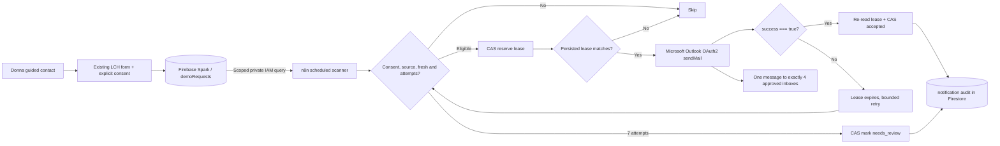

# LCH commercial email activation: Firebase Spark + n8n + Microsoft 365

**Owner:** LCH technical lead. **Status:** NOT LIVE. **Date:** 2026-10-10. **Graph:** GH-28.

## Business acceptance contract

For each fresh, consented contact submitted at `https://lch-app.cloud`, retain the lead in `rag-municipalidades` / Firestore named database `ai-studio-8963e7a3-87ce-4ca9-938c-9490f698d4c7` / `demoRequests` using the existing Spark flow. Send exactly **one** Outlook message from `contacto@lch-technologies.com` addressed to all four approved recipients:

- `contacto@lch-technologies.com`
- `eduardo.sacahui@lch-technologies.com`
- `lina.saldarriaga@lchtechnologies.onmicrosoft.com`
- `sara.saldarriaga@lchtechnologies.onmicrosoft.com`

`Reply-To` is the prospect, and consent is mandatory. A Microsoft API acceptance is **not** proof all four mailboxes received the message. Do not announce delivery without receipts or Exchange message trace. Firebase must remain **Spark**, no Cloud Functions, no Blaze or billing changes.

## Choose ONE executor before creating credentials

| Candidate | Current evidence | Operational implication |
| --- | --- | --- |
| Cloud Sandbox `n8n-lina` | LCH GH-28 workflow installed **inactive** (13 nodes), Lina active, `credentials_entity` count 0, keeper RUNNING; no owner login in Mac browser | OAuth redirect for this container must point to an authenticated/private HTTPS callback reachable from the operator's browser, not the Mac's localhost. Validate site/host startup persistence. |
| Mac `http://localhost:5678` | Chrome owner session verified; ONLY Lina workflow listed, **Create your first credential** view, so LCH is not imported | Import GitHub LCH JSON there and configure credentials in **this** instance; separately supervise the Mac n8n runtime with its existing macOS/Docker stack. Cloud Sandbox keeper does not protect it. OAuth callback visible: `http://localhost:5678/rest/oauth2-credential/callback`. |

**Do not activate both.** The Cloudflare Worker GH-25 remains *undeployed*; leave it that way. The product's real Firestore source is a single shared database, so double automation would send the same lead twice.

## Microsoft 365 administrator — Outlook delegated OAuth2

1. Confirm `contacto@lch-technologies.com` is a real Exchange Online mailbox and the selected OAuth user may send **as** that mailbox. Being a recipient does not imply Send As.
2. In Microsoft Entra for the organization `lchtechnologies.onmicrosoft.com`, create a dedicated app registration such as `LCH n8n Lead Mail` (single-tenant), with the correct **Web redirect URI of the chosen n8n executor**. For the authenticated Mac instance the n8n credential UI displays `http://localhost:5678/rest/oauth2-credential/callback`. For Cloud Sandbox use an operator-accessible callback of that container, secured with authentication; do not substitute the Mac localhost callback.
3. Configure Microsoft Graph **delegated** permissions as required by the installed n8n Microsoft Outlook credential, including `Mail.Send` plus scopes needed for user identity and refresh. Use the least privilege possible; do **not** grant tenant-wide **application** `Mail.Send` just to send from one mailbox. Review tenant consent requirements.
4. Generate a client secret and store it **only inside the selected n8n encrypted credential store**. Never paste the client secret, refresh token, service-account JSON or OAuth browser cookie into this repository, GitHub Actions, chats or client-side JS. Create `Microsoft Outlook OAuth2 API` credential in n8n, enter the Entra Client ID/Secret, then **Connect my account** through the visible Microsoft consent screen.
5. Confirm the OAuth identity is the desired mailbox or an approved delegated identity with Send As. Test a separate non-production draft/send and inspect From, Reply-To and Received headers. A successful OAuth handshake is not proof that `contacto@...` may send.

## Google administrator — Firestore service-account credential

1. In Google Cloud IAM for `rag-municipalidades`, create a dedicated service identity for LCH notifications. Grant only Firestore query/read and conditional document update on the **named** database when supported. Do not use a Firebase client API key as an admin credential, open Firestore Security Rules, or use an unrelated Google account's long-lived personal tokens.
2. Under a policy permitting service-account keys, securely provision the key into the selected n8n's encrypted **Google Service Account API** (`googleApi`) credential. Set the datastore scope `https://www.googleapis.com/auth/datastore` and make it usable by the native Firestore node and HTTP Request's predefined credential. If service-account key creation is disabled by policy, use a properly supported workload-identity design rather than weakening org policy.
3. Bind that **one** credential to all five service-account nodes: `Read Consented Contacts`, `Claim Firestore Lease`, `Record Needs Review`, `Re-read Firestore Lease`, and `Record Outlook Acceptance`.
4. Test only the read/query operation first. Verify it sees the correct Firestore named database and observes the `createdAt` timestamp; this must **not** trigger the Outlook node. Recheck Firestore IAM against a different database to ensure scope is appropriately restricted.

## Safe cutover and proof

1. Import `workflows/n8n/lch-contact-mail-spark.workflow.json` into the **selected** n8n. Keep `active=false`; confirm 13 nodes, compare Lina's workflow before/after and back up n8n's data. Avoid creating credentials on one n8n instance and importing the workflow into another.
2. Attach Google and Outlook credentials. Verify n8n editor authentication, process restart behavior, disabled execution-data persistence and a functional Firestore read. `scripts/lch_n8n_release_preflight.py` audits the *Cloud Sandbox local database* by default, or accepts `--database` for another local n8n SQLite DB. It never reads encrypted credential values.
3. Set `Activation UTC` to the current real UTC instant immediately before the controlled test, preventing retrospective sending to older QA contacts. Validate `source=website`, user consent, and known interest. Submit a new, explicitly synthetic contact **after** the cutoff with the normal form and manual consent checkbox.
4. Manually run the flow once. Verify the Firestore transaction/lease claim and that the Outlook v2 node returns `{success:true}`; confirm the lead transitions to `notification.state=accepted` only after provider acceptance. Check the **four actual Outlook inboxes** or Exchange message trace. If anything fails, remain inactive and preserve the Firestore lead for recovery.
5. Verify replay does not resend a record already marked accepted. Inspect the `needs_review` path for seven failed attempts via a separate synthetic fixture, not by spamming real recipients. Validate the keeper/reboot behavior of the **chosen** host.
6. **Only then** activate the recurring n8n Schedule Trigger. Do not deploy/enable the separate Cloudflare Worker. Add alerts for n8n downtime, expiry of Microsoft credentials, `needs_review`, failed workflows and high Firestore reads.

## Reversal / incident response

Disable the *LCH* n8n workflow immediately; **do not disable Lina** or delete existing `demoRequests`. Do not reset `notification.state=accepted` during retries. Preserve the stable `x-lch-lead-id` for message trace and customer follow-up. Rotate any compromised keys from their original identity provider and rebind encrypted credentials. If a provider accepted mail but Firestore acknowledgment failed, use Exchange trace to prevent unintended duplicates before replay.

## Evidence required for GH-28 live delivery gate

- Identity of the **single selected n8n runtime**, accessible admin URL and verified restart policy.
- Google SA Firestore query and scoped CAS update authorized; Microsoft Outlook OAuth connected and Send As checked.
- Verified synthetic **consented** lead after activation; Firestore `notification.state=accepted` and exact lead reference.
- Message header/Exchange trace showing sender `contacto@lch-technologies.com` and **receipts at all four recipient addresses**; exclude test lead from commercial pipeline.
- Distinct `needs_review` retry-exhaustion and no-duplicate-accepted tests, production log metadata without PII.

Until this evidence exists, release status is **CODE QUALITY PASSED — LIVE MAIL DELIVERY BLOCKED**. No secrets or API keys belong in these documents.

## Architecture diagram

*Only one external n8n executor should run this route. Google and Microsoft credentials are server-only. The graph shows control flow, not proof that any external email has been sent.*
